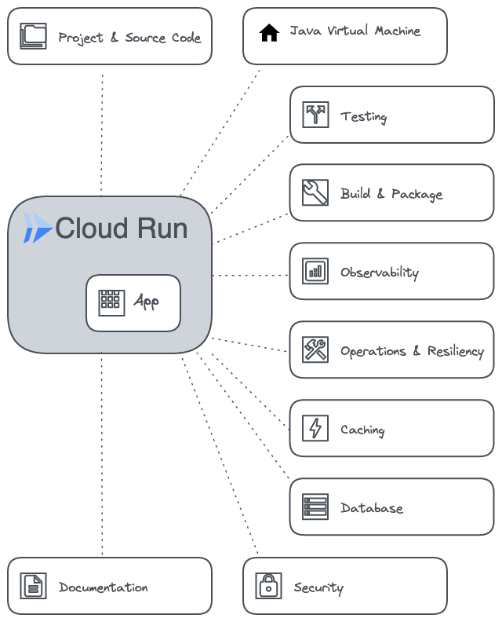
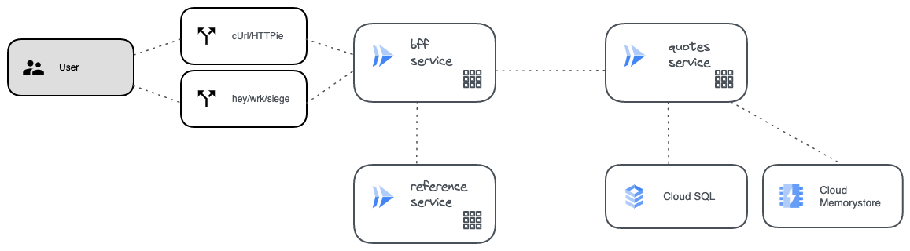

# Optimize Java Apps in Cloud Run - Google Cloud

This material dives into the `features of optimized, modern Java applications deployed in Cloud Run in the Google Cloud`. It is intended to be a `living repo` where new optimizations will constantly be added.

## Why this work
App Optimization for Cloud Run should always be framed in the larger context of production readiness of a service for a Cloud Run PROD environment. 

There are multiple aspects to `writing effective services for serverless environments` and they all revolve around the combination of service design, implementation, testing, configuration with environment configuration and optimization best practices. 

Optimization is `shifted-left` and part of the service dev lifecycle from the beginning.

## How to think about production-readiness 
You generally think that a **production-ready cloud service must be:**
* Stable and Reliable
* Scalable and Performant
* Fault Tolerant without any single point of failure
* Properly Monitored
* Documented and Understood
* Properly secured

## How to think about optimizations
Optimizing any app for Cloud Run requires a balance of different aspects to be considered, therefore it is important to always have a clear picture of **what it is that you are optimizing for**:
* start-up time
* execution latency
* resource consumption (memory & CPU)
* concurrency
* image size
* easy maintainability
* lower costs

## Outcomes
This material contains lessons learned from participation in various projects or publicly available knowledge and documentation. 

You can:
* revisit the production-readiness checklist as you build the service and review it before deploying services to a Production serverless environment
* use the material as a starting point for optimization workshops or discussions around production readiness

Materials:
* production-readiness `checklist`
* app w/`complete set` of services (code, config, environment setup) following best practices
* alternate versions of the services showing `what is happening if you don't do this`

## Service production-readiness checklist

## The App
A set of services is provided to illustrate the different aspects, following this simple architecture:

# Production Readiness Checklist 

## Project & Source Code
Source code recommendations can be grouped into the following distinct categories:

* Java [[see]](docs/checklists/java/Code.md)
* Go

## Runtime Optimizations

* Java [[see]](docs/checklists/java/JVM.md)
* Go

## Testing 

* Java [[see]](docs/checklists/java/Test.md)
* Go

## Build and Packaging
* Use cloud-native buildpacks to build the container images
* Minimize container images by using optimized container images

## Observability
* 

## Operations and Resiliency
* 

## Caching 
* 
## Database 
* 
## Security
* 

## Documentation